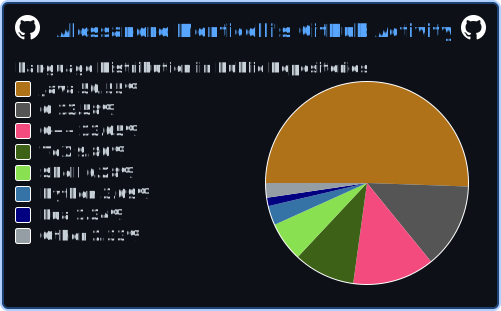
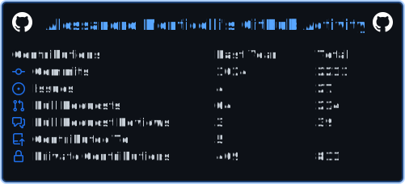
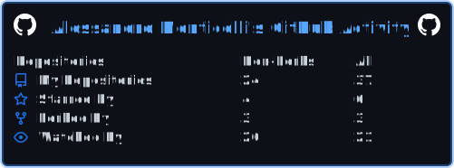

- MSc in Computer Science and Engineering at "Alma Mater Studiorum - University of Bologna".
- I like Embedded Systems, backend programming, systems integration, virtualization and tinkering with parallel programming.
- I’m currently studying Embedded Systems, Software Engineering, Web Technologies and Parallel Programming.
- You can reach out to me here: [ LinkedIn](https://www.linkedin.com/in/ale-mont/) 📬[Email](mailto:alessandro.monticelli@live.it)
- My CV is [here](https://aleemont1.github.io/one-page-cv/resume.pdf)

  
    
    
    
  

