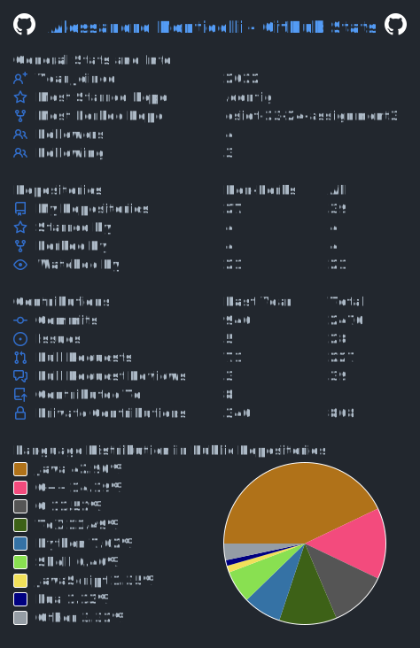

  
  # Hi there, I'm Alessandro! 👋

  ### 🚀 Embedded Software Engineer | Computer Engineering MSc
  
  _Turning hardware constraints into software possibilities. Passionate about Rocketry, RTOS, and Mission-Critical Systems._

  
  
  

 

## 🔬 What I'm Working On

I specialize in **firmware development**, **telemetry protocols**, and **real-time systems**. Here are some highlights from my recent work:

### 🚀 **Aurora Rocketry Team** | *Project Manager & Lead Avionics*
Leading a team to develop the avionics for a sounding rocket.
* **Flight Computer:** Designed an **ESP32-based** system running **FreeRTOS** for real-time task scheduling.
* **Telemetry:** Integrated a long-range communication system coordinating with a custom Ground Station.

### 📡 **LoRa Research** | *Undergraduate Researcher @ Unibo*
Developing reliable telemetry protocols under the supervision of Prof. Andrea Piroddi.
* **Protocol Design:** Engineered a segmented-packet protocol over LoRa to maximize throughput.
* **Results:** Achieved **95% packet recovery at 500m** with a data rate of ~640 Bytes/s in field tests.
* **Paper:** Authoring a research paper on LoRa payload segmentation (Target: IEEE 2026).

---

## 🛠️ Technical Arsenal

  | Domain | Technologies & Tools |
  | :--- | :--- |
  | **Embedded & IoT** | C, C++, FreeRTOS, ESP32, Arduino, LoRa, MQTT, Sensor Fusion |
  | **Backend & Core** | Python, .NET 8.0 (C#), Java, NuGet |
  | **DevOps & SysAdmin** | Docker, Kubernetes, GitHub Actions, Linux Server, Active Directory |
  | **Parallel Computing** | CUDA, OpenMP, OpenMPI, SIMD Optimization |

---

  ## 📊 GitHub Analytics
  
  

    
  

