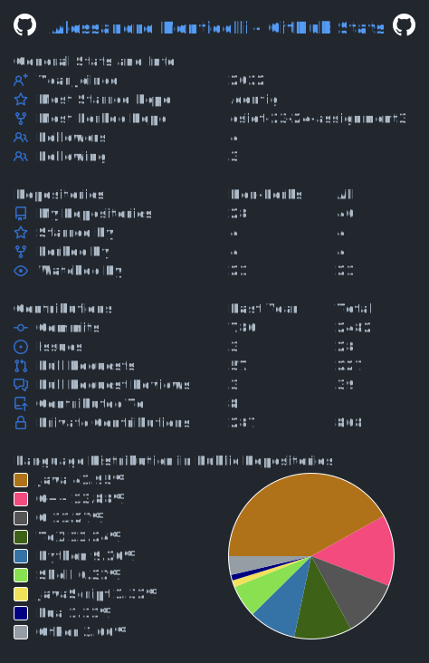

  
  # Hi there, I'm Alessandro! 👋

  
  
  _Turning hardware constraints into software possibilities. Passionate about Rocketry, Embedded Systems, low-level and back-end programming._

  
  
  

 

## 🔬 What I'm Working On

I specialize in **firmware development**, **telemetry protocols**, and **real-time systems**. Here are some highlights from my recent work:

### 🚀 **Aurora Rocketry Team** | *Project Manager & Lead Avionics*
Leading a team to develop the avionics for a sounding rocket.
* **Flight Computer:** Designed an **ESP32-based** system running **FreeRTOS** for real-time task scheduling.
* **Telemetry:** Integrated a long-range communication system coordinating with a custom Ground Station.

### 📡 **LoRa Research** | *Undergraduate Researcher @ Unibo*
Developing reliable telemetry protocols under the supervision of Prof. Andrea Piroddi.
* **Protocol Design:** Engineered a segmented-packet protocol over LoRa to maximize throughput.
* **Results:** Achieved **95% packet recovery at 500m** with a data rate of ~640 Bytes/s in field tests.
* **Paper:** Authoring a research paper on LoRa payload segmentation (Target: IEEE 2026).

---

## 🛠️ Technical Arsenal

  ### ⚡ Embedded & IoT
  
  
   

  ### 💻 Backend & Core
  
  
   

  ### 🐳 DevOps & Parallel Computing
  

---

  ## 📊 GitHub Analytics
  
  

    
    
  

  ### 🐍 Contribution Activity
  <picture>
    <source media="(prefers-color-scheme: dark)" srcset="https://raw.githubusercontent.com/aleemont1/aleemont1/output/github-contribution-grid-snake-dark.svg">
    <source media="(prefers-color-scheme: light)" srcset="https://raw.githubusercontent.com/aleemont1/aleemont1/output/github-contribution-grid-snake.svg">
    
  </picture>

